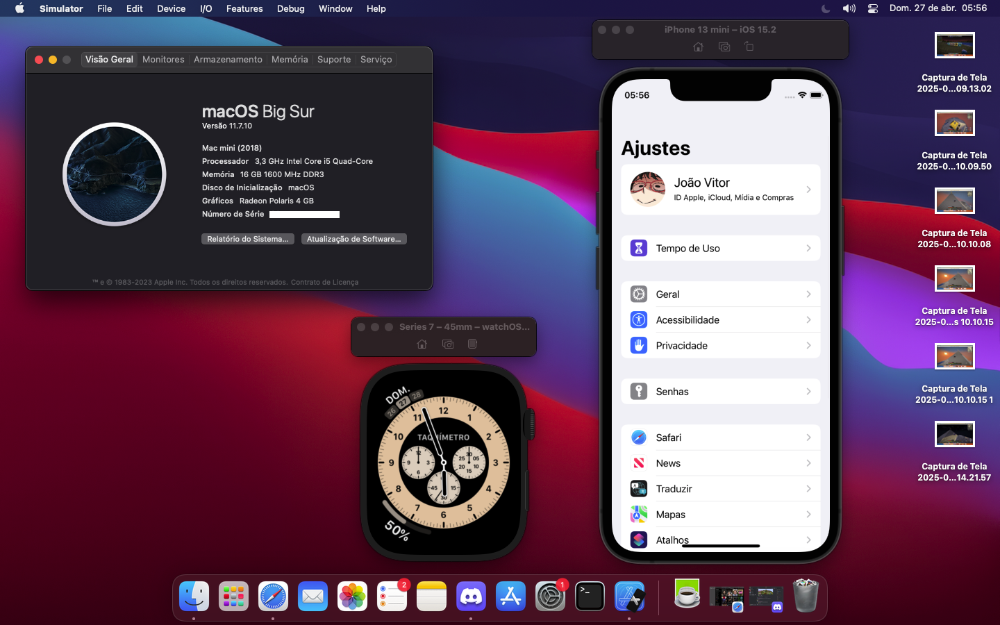

# EFI OC Haswell + RX550 Lexa 4GB (Metal2)

<b>Build:</b> 
Mobo: Kingster H81 1150 DDR3 
CPU: Intel Core i5-4590 3.70GHz 
Ram: 16GB Dual-Channel Kingston DDR3 1600MHz 
Storage: 256GB NVME 
GPU: Mancer RX550 Lexa 4GB 
 
<b>Compatible Versions:</b> 

macOS Catalina (10.15): ✅, Good and consistent performance. 
macOS Bigsur: ✅, Good and consistent performance. (RECOMMENDED!). 
macOS Monterey: ✅, Good performance. 
macOS Ventura: ✅, Performance OK, but very usable. 
macOS Sonoma: ⚠️, Usable, but with much of the performance compromised by the absence of Metal 3 on the GPU. 
macOS Sequoia: ⚠️, Usable, but with much of the performance compromised by the absence of Metal 3 on the GPU. 
 

<b>Tutorial:</b>

Open the terminal and type: 
**`diskutil list`** - this will list all your disks  
**`sudo diskutil mount /dev/yourdisk`** - this will mount your efi partition according to your disk (e.g. /dev/disk0s1) 
 After that, just delete the old EFI and move the new one to the partition, and you're done! 
You have a working Hackintosh Haswell with RX550 Lexa
  
<b>Important Links:</b> 
<a href=https://olarila.com>Olarila</a> 
<a href=https://dortania.github.io>Dortania</a>
 

<b>Working Setup:</b> 

