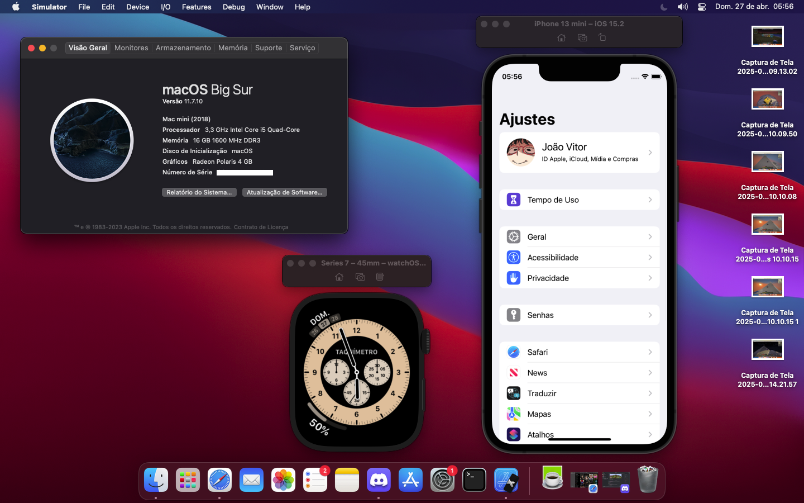

# EFI OpenCore macOS Sequoia/Sonoma on i5-4590 & RX550-Lexa
<b>PT-iNFO: Pasta EFI de configuração do OpenCore com suporte ao i5-4590 e RX550 Lexa! 
EN-iNFO: OpenCore Configuration EFI Folder with i5-4590 and RX550 Lexa support!</b>

<b>BUILD:</b> 
Mobo: Kingster H81 1150 DDR3 
CPU: Intel Core i5-4590 3.70GHz 
Ram: 16GB Dual-Channel Kingston DDR3 1600MHz 
Storage: 256GB NVME, 1TB Seagate HDD 
GPU: Mancer RX550 Lexa 4GB 
PSU: EVGA 400W 

<b>Tutorial:</b> 
Open the terminal and type: 
**`diskutil list`** - this will list all your disks  
**`sudo diskutil mount /dev/yourdisk`** - this will mount your efi partition according to your disk (e.g. /dev/disk0s1) 
 After that, just delete your old EFI and move the new EFI to the partition, and that's it! 
you have a Hackintosh Sequoia/Sonoma with i5-4590 + RX550 Lexa working 100%.
 <b>If you need help, I am available to help via <a href="https://discord.gg/YT3yTaHsrK">Discord!</a></b>

<b>Working Setup:</b> 

